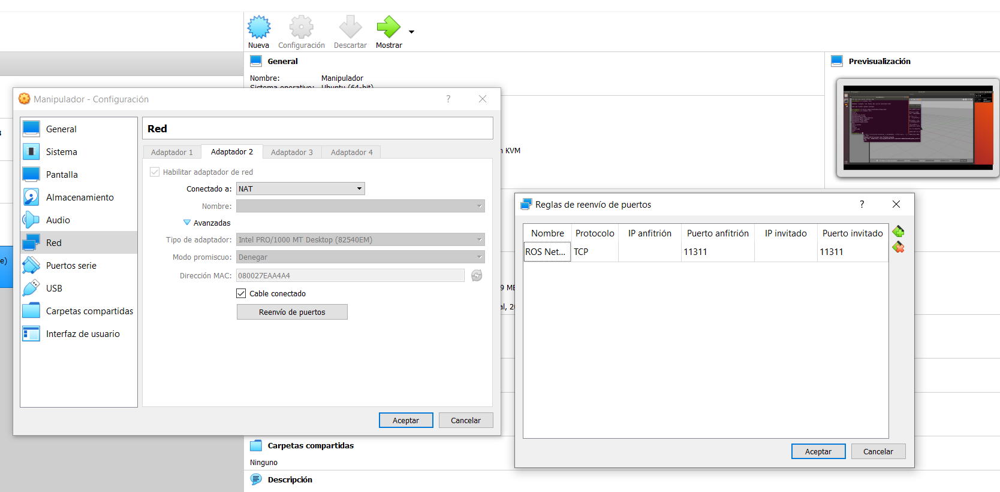

## Resources 
*	[Virtual manipulator challenge main page](https://2021.robocup.org/robot-manipulation) 
* [robocup@work team qualifications](https://atwork.robocup.org/2021/03/12/robocup-2021-worldwide-call-for-participation/) 
* [github getting started](https://github.com/mathworks-robotics/templates-robocup-robot-manipulation-challenge)
*	 [Design and Control of Robot Manipulators ](https://www.facebook.com/notes/matlab-and-simulink-robotics-arena/design-and-control-of-robot-manipulators-technical-resources/3351011848336733/) 
* [get started with gazebo](https://www.mathworks.com/help/ros/ug/get-started-with-gazebo-and-a-simulated-turtlebot.html)

## About the system
The work is based on the vmware virtual machine provided by the github getting started. It contains: 
* ROS 2 Dashing desktop installation
* ROS Melodic desktop installation
* Gazebo robot simulator 9.0.0
* Example Gazebo worlds for a simulated TurtleBot® 3

Checking the version of the software packages
```
lsb_release -a
gazebo -v
```

* ubunto version: 18.04.5
* gazebo version 9.16.0

The project uses ros_kortex  robotic arm for the virtual manipulator  

The virtualization platform used was virtual box  instead of vmware workstation

## Config
* running and testing the vm (virtual machine) works
* take a snapshot of the vm in order to have a backup to go back to if something goes wrong.  
* using virtual box Guest additions to get full-screen 
* activate share clipboard to copy paste to work between both in host and guest
* add [Spanish keyboard](https://askubuntu.com/questions/1014585/how-to-add-a-latin-american-keyboard-in-17-10): changing the default keyboard layout from English to Spanish  simplifies the use of special characters

  ```
  sudo locale-gen es_AR.UTF-8
  ```

* Configure Network between guest and host. Enable network adapter with __NAT__ configuration and allow port forwarding in advance settings. The port 11311 needs to be forward in order for the host computer to connect to ROS network.  NAT (Network Adress Translation) creates a private network for the guest vm.
  


* Check the virtual box network tool to identify network adaptor of the host computer ```192.168.56.1```
  
## Environment exploration
Files related to the project are located at the Desktop inside the Robocup Challenge folder. Exploring these files ( ```Example World 1.desktop```) from the command line give an insight in how they work
```
cd "Desktop/RoboCup Challenge"
less "Example World 1.desktop"
```

Content of  ```Example World 1.desktop```: 
```
[Desktop Entry]
Version=1.0
Comment=Launch example world for RoboCup challenge
Exec=/home/user/start-robocup-example-world-1.sh
Terminal=false
Type=Application
Categories=Utility;Application;
Icon=/usr/share/icons/Tango/32x32/mimetypes/gnome-mime-application-x-executable.png
Name[en_US]=Example World 1
```

This file launches a  shell script ```~/start-robocup-example-world-1.sh```

```
less ~/start-robocup-example-world-1.sh
```

Content of ```~/start-robocup-example-world-1.sh```:
```
#!/bin/sh
# Shortcut shell script to start pickandplace recycling world
export SVGA_VGPU10=0
export ROS_IP=$(hostname -I | tr -d [:blank:])
export ROS_MASTER_URI=http://$ROS_IP:11311
export GAZEBO_PLUGIN_PATH=/home/user/src/GazeboPlugin/export:$GAZEBO_PLUGIN_PATH
# Launch Gazebo world with kortex
gnome-terminal --title="Gazebo Recycling World - Depth Sensing" -- /bin/bash -c 'source /opt/ros/melodic/setup.bash; source ~/catkin_ws/devel/setup.bash; roslaunch kortex_gazebo_depth pickplace.launch world:=RoboCup_1.world '
```

This file open a gazebo world from the ROS project found at  ```~/catkin_ws/```


search for the robot model (urdf) 
```
cd ~/catkin_ws
ls -R | grep urdf
```

```./src/ros_kortex/kortex_description/arms/gen3/urdf```

### Connect to MATLAB 
* Select on of the available gazebo files on the desktop, it would run a gazebo world.
* Run ```source /opt/ros/melodic/setup.bash``` in order to add the ROS environment variable and be able to run ROS command from the shell then try runnign ```rostopic list``` to test it is working 
* Thanks to the network configuration, a MATLAB instance running in the host environment can connect to the guest __vm__  ROS network. One needs to provide the ROS master URI by providing an IP address and a port. The following script in MATLAB would start the connection.

```{matlab}
ipaddress = '192.168.56.1';
rosinit(ipaddress,11311);

% Initializing global node /matlab_global_node_47691 with NodeURI http://192.168.56.1:59106/
```
